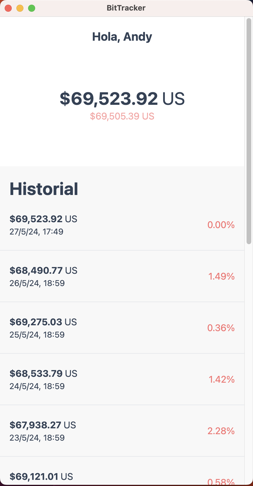
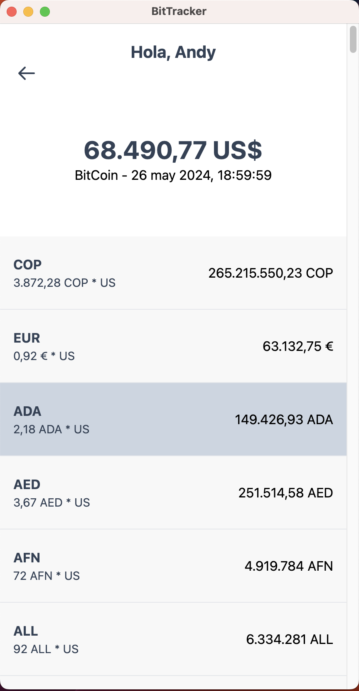

# BitTracker - A Bitcoin Tracker

BitTracker es una aplicación para visualizar el precio diario del Bitcoin y en diferentes divisas, construida con Angular, Electron y RxDB.

## Descripción

BitTracker permite a los usuarios:

- Visualizar el precio del Bitcoin en tiempo real.
- Consultar el precio de cierre de los últimos 10 días.
- Observar el porcentaje de variación respecto al precio actual.

## Capturas

## Instalación

Para instalar las dependencias del proyecto, ejecuta el siguiente comando:

```bash
yarn
# o
npm install
```

## Uso

Para ejecutar la aplicación en modo desarrollo, utiliza el siguiente comando:

```bash
yarn run electron
```

Para empaquetar la aplicación y generar un ejecutable, ejecuta:

```bash
yarn make
```

El ejecutable se generará en la carpeta `out` en la raíz del proyecto.

## Licencia

Este proyecto está licenciado bajo la Licencia MIT. Consulta el archivo [LICENSE](LICENSE) para obtener más detalles.

---

Este README incluye toda la información esencial sobre tu proyecto BitTracker. Puedes copiar este texto y colocarlo en tu archivo `README.md` en GitHub. Si necesitas más ajustes o agregar algún detalle adicional, házmelo saber.

## Screenshots



